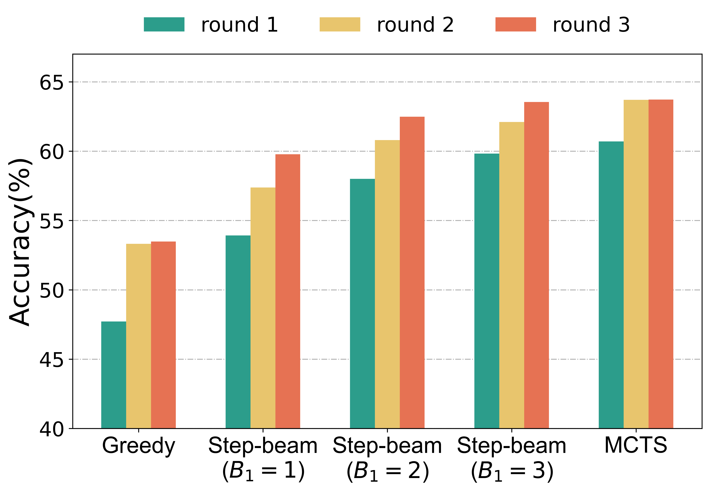

# Super MARIO: process Supervision without process for MAth Reasoning with code Interpreter Output

[AlphaMath-7B 🤗](https://huggingface.co/MARIO-Math-Reasoning/AlaphaMath-7B)

Code will be released soon. Stay tuned.

This is the official repo for paper [AlphaMath Almost Zero: process Supervision without process](https://arxiv.org/abs/2405.03553). Our approach involves training the policy and value models using only the mathematical reasoning derived from the Monte Carlo Tree Search (MCTS) framework, eliminating the need for GPT-4 or human annotations. 


## Training Data Generation from MCTS


## Value Estimation


## Inference



| Inference Method       | Accuracy | avg. time (s) per question | avg. steps | 
| ---------------------- | -------- | -------------------------- | ---------- |
| Greedy                 | 53.48    | 1.6                        | 3.10       |
| Step-level Beam (1,5)  | 59.78    | 3.1                        | 3.01       |
| Step-level Beam (2,5)  | 62.48    | 2.4                        | 2.36       |
| Step-level Beam (3,5)  | 63.54    | 2.3                        | 2.21       |
| MCTS                   | 63.72    | 20.3                       | 3.76       |


## Citation
MCTS version
```
@misc{chen2024alphamath,
      title={AlphaMath Almost Zero: process Supervision without process}, 
      author={Guoxin Chen and Minpeng Liao and Chengxi Li and Kai Fan},
      year={2024},
      eprint={2405.03553},
      archivePrefix={arXiv},
      primaryClass={cs.CL}
}
```

Evaluation toolkit
```
@misc{zhang2024mario,
      title={MARIO Eval: Evaluate Your Math LLM with your Math LLM--A mathematical dataset evaluation toolkit}, 
      author={Boning Zhang and Chengxi Li and Kai Fan},
      year={2024},
      eprint={2404.13925},
      archivePrefix={arXiv},
      primaryClass={cs.CL}
}
```

OVM (Outcome Value Model) version
```
@misc{liao2024mario,
      title={MARIO: MAth Reasoning with code Interpreter Output -- A Reproducible Pipeline}, 
      author={Minpeng Liao and Wei Luo and Chengxi Li and Jing Wu and Kai Fan},
      year={2024},
      eprint={2401.08190},
      archivePrefix={arXiv},
      primaryClass={cs.CL}
}
```
