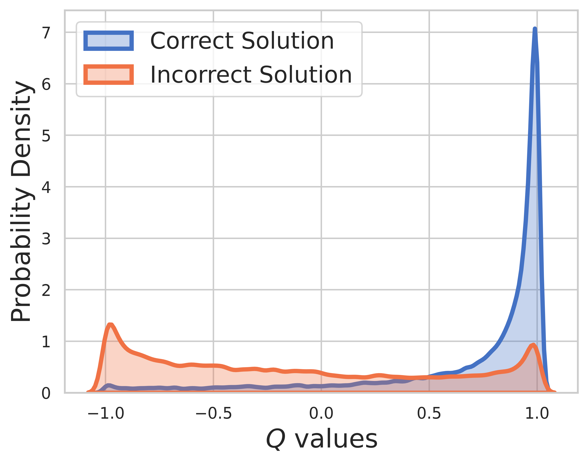

# Super MARIO: process Supervision without process for MAth Reasoning with code Interpreter Output


## 💥 News 💥
- **RI Recruitment** If you're interested in a research intern position of mathematical reasoning at Qwen team, please feel free to apply <a href="https://careers-tongyi.alibaba.com/campus/position-detail?lang=zh&positionId=2028312">here</a>. 
- **[2024.06.15]** Release another work by leveraging MCTS [Step-level Value Preference Optimization for Mathematical Reasoning (EMNLP 2024 Findings)](https://arxiv.org/abs/2406.10858).
- **[2024.05.06]** Release our work [AlphaMath Almost Zero: process Supervision without process (NeurIPS 2024)](https://arxiv.org/abs/2405.03553).
- **[2023.04.22]** Release our math evaluation toolkit [github](https://github.com/MARIO-Math-Reasoning/MARIO_EVAL) and related [report](https://arxiv.org/abs/2404.13925).
- **[2024.01.16]** Release our work [MARIO (ACL 2024 Findings)](https://arxiv.org/abs/2401.08190).

This is the official repository for paper [AlphaMath Almost Zero: process Supervision without process](https://arxiv.org/abs/2405.03553). The code is extracted from our internal corporate codebase. As a result, there may be slight differences when reproducing the numbers reported in our paper, but they should be very close. Our approach involves training the policy and value models using only the mathematical reasoning derived from the Monte Carlo Tree Search (MCTS) framework, eliminating the need for GPT-4 or human annotations. This is an illustration of [training instance](imgs/mcts_example.pdf) generated by MCTS in round 3. 

- [x] [Greedy](https://github.com/MARIO-Math-Reasoning/Super_MARIO?tab=readme-ov-file#greedy-decoding)
- [x] [Step Beam](https://github.com/MARIO-Math-Reasoning/Super_MARIO?tab=readme-ov-file#step-level-beam-search)
- [x] [MCTS](https://github.com/MARIO-Math-Reasoning/Super_MARIO?tab=readme-ov-file#mcts)

**Checkpoint**: [AlphaMath-7B round 3 🤗](https://huggingface.co/MARIO-Math-Reasoning/AlaphaMath-7B) / [AlphaMath-7B round 3 🤖](https://www.modelscope.cn/models/iic/AlphaMath-7B)

**Dataset**: [AlphaMath-Round3-Trainset 🤗](https://huggingface.co/datasets/MARIO-Math-Reasoning/AlphaMath-Trainset) The solution process of the training data is automatically generated based on MCTS and checkpoint in round 2. Both positive and negative examples are included for training the policy and value models.

**Training Code**: Due to policy, we can only release the [implementation details](https://github.com/MARIO-Math-Reasoning/Super_MARIO/blob/main/implementation_details.md) of some key functions, which should basically be modified in your own training code.

## Inference on MATH dataset

| Inference Method       | Accuracy | avg. time (s) per q | avg. steps | # sols | 
| ---------------------- |:--------:|:-------------------:|:----------:|:------:|
| Greedy                 | 53.62    | 1.6                 | 3.1        | 1      |
| Maj@5                  | 61.84    | 2.9                 | 2.9        | 5      |  
| Step-level Beam (1,5)  | 62.32    | 3.1                 | 3.0        | top-1      |
| &nbsp;&nbsp; 5 runs + Maj@5   | 67.04    | &nbsp;&nbsp; x5    | &nbsp;&nbsp; x1  | 5 top-1|
| Step-level Beam (2,5)  | 64.66    | 2.4                 | 2.4        | top-1      |
| Step-level Beam (3,5)  | 65.74    | 2.3                 | 2.2        | top-1      |
| Step-level Beam (5,5)  | 65.98    | 4.7                 | 2.3        | top-1      |
| &nbsp;&nbsp; 1 run + Maj@5   | 66.54    | &nbsp;&nbsp; x1     | &nbsp;&nbsp; x1  | top-5|
| &nbsp;&nbsp; 5 runs + Maj@5  | 69.94    | &nbsp;&nbsp; x5     | &nbsp;&nbsp; x1  | 5 top-1|
| MCTS (N=40)            | 64.02    | 10.1                | 3.8        | top-1      |

1. In Step-level Beam (1,5), it will only return the top-1 solution. So `+ Maj@5` requires to run 5 times, which encourage diversity. 
2. In Step-level Beam (5,5), it will return top-5 solutions. So `+ Maj@5` directly uses the 5 candidates, which lack of diversity.

| temperature            | 0.6      | 1.0     | 
| ---------------------- |:--------:|:-------:|
| Step-level Beam (1,5)  | 62.32    | 62.76   |
| Step-level Beam (2,5)  | 64.66    | 65.60   |
| Step-level Beam (3,5)  | 65.74    | 66.28   |
| Step-level Beam (5,5)  | 65.98    | 66.38   |

For step-level beam search, setting `temperature=1.0` may achieve slightly better results.


## Installation
1. Install `requirements.txt`
```
pip install -r requirements.txt
```
2. Install the [evaluation toolkit](https://github.com/MARIO-Math-Reasoning/MARIO_EVAL?tab=readme-ov-file#install-as-python-package) as a package.
3. Install our customized [vllm](https://github.com/MARIO-Math-Reasoning/vllm) to support value model.

Or simply follow the cmds
```bash
> git clone https://github.com/MARIO-Math-Reasoning/Super_MARIO.git
> git clone https://github.com/MARIO-Math-Reasoning/MARIO_EVAL.git
> git clone https://github.com/MARIO-Math-Reasoning/vllm.git

> cd Super_MARIO && pip install -r requirements.txt && cd ..

> cd MARIO_EVAL/latex2sympy && pip install . && cd ..
> pip install -e .

> cd ../vllm
> pip install -e .
```


## Checkpoint Initialization
1. Download the [deepseek-math-7b-base](https://huggingface.co/deepseek-ai/deepseek-math-7b-base).
2. You can use the `scripts/save_value_head.py` to add the value head to the LLM.


## Greedy Decoding
You can run either of the following two cmds. There may be slightly difference of accuracy between the two. In our machine, the first got 53.4% and the second got 53.62%.
```
python react_batch_demo.py \
--custom_cfg configs/react_sft.yaml \
--qaf ../MARIO_EVAL/data/math_testset_annotation.json
```
or
```
# use step_beam (1, 1) without value func
python solver_demo.py \
--custom_cfg configs/sbs_greedy.yaml \
--qaf ../MARIO_EVAL/data/math_testset_annotation.json
```


## Step-level Beam Search
In our machine, on MATH testset, the following cmd with config `B1=1, B2=5` can achieve ~62%, and the one with config `B1=3, B2=5` can reach ~65%.
```
python solver_demo.py \
--custom_cfg configs/sbs_sft.yaml \
--qaf ../MARIO_EVAL/data/math_testset_annotation.json
```
Calculate the accuracy
```
python eval_output_jsonl.py \
--res_file <the saved tree jsonl file by solver_demo.py>
```

## MCTS
### Training data generation. 


The `ground_truth` (the final answer, not the solution process) must be provided in `qaf` json or jsonl file (example format can refer to `../MARIO_EVAL/data/math_testset_annotation.json`).

round 1
```
# Checkpoint Initialization is required by adding value head
python solver_demo.py \
--custom_cfg configs/mcts_round1.yaml \
--qaf /path/to/training/data
```

round > 1, after SFT
```
python solver_demo.py \
--custom_cfg configs/mcts_sft_round.yaml \
--qaf /path/to/training/data
```

### Inference. 

Only `question` will be used for solution generation, but the `ground_truth` will be used for calculating the accuracy.
```
python solver_demo.py \
--custom_cfg configs/mcts_sft.yaml \
--qaf ../MARIO_EVAL/data/math_testset_annotation.json
```
Different from step-level beam search, you need first to build a complete tree, then you should run the MCTS offline then calculate the accuracy.
```
python offline_inference.py \
--custom_cfg configs/offline_inference.yaml \
--tree_jsonl <the saved tree jsonl file by solver_demo.py>
```
Note: this evaluation script can also be run with saved tree by step-level beam search, and the accuracy should remain the same.


## Value Estimation

### Distribution of Q-value for intermediate steps on training data. 

Because ground truth is known for training data, the value of final step is reward and Q-value can converge very well.


### Distribution of Q-value for both intermediate and final steps on test data. 

On test set, the ground truth is unknown, so the Q-value distribution includes both intermediate and final steps. From this figure, we can find
1. When model prediction is correct, its Q-value also converges towards 1.
2. For solutions with incorrect final answer, the distribution of Q-value covers all [-1,1], because the intermediate steps may be correct.
3. When the value model believes the solution predicted by the policy model to be incorrect, the Q-values cluster around $-1$.
4. There are instances where the value model erroneously considers an incorrect solution as correct, where the Q-values have a peak rouand 1. This pattern represents the bad cases of the value model.




## Citation
SVPO by MCTS
```
@misc{chen2024steplevelvaluepreferenceoptimization,
      title={Step-level Value Preference Optimization for Mathematical Reasoning}, 
      author={Guoxin Chen and Minpeng Liao and Chengxi Li and Kai Fan},
      year={2024},
      eprint={2406.10858},
      archivePrefix={arXiv},
      primaryClass={cs.CL},
      url={https://arxiv.org/abs/2406.10858}, 
}
```

MCTS version
```
@misc{chen2024alphamathzeroprocesssupervision,
      title={AlphaMath Almost Zero: process Supervision without process}, 
      author={Guoxin Chen and Minpeng Liao and Chengxi Li and Kai Fan},
      year={2024},
      eprint={2405.03553},
      archivePrefix={arXiv},
      primaryClass={cs.CL},
      url={https://arxiv.org/abs/2405.03553}, 
}
```

Evaluation toolkit
```
@misc{zhang2024marioevalevaluatemath,
      title={MARIO Eval: Evaluate Your Math LLM with your Math LLM--A mathematical dataset evaluation toolkit}, 
      author={Boning Zhang and Chengxi Li and Kai Fan},
      year={2024},
      eprint={2404.13925},
      archivePrefix={arXiv},
      primaryClass={cs.CL},
      url={https://arxiv.org/abs/2404.13925}, 
}
```

OVM (Outcome Value Model) version
```
@misc{liao2024mariomathreasoningcode,
      title={MARIO: MAth Reasoning with code Interpreter Output -- A Reproducible Pipeline}, 
      author={Minpeng Liao and Wei Luo and Chengxi Li and Jing Wu and Kai Fan},
      year={2024},
      eprint={2401.08190},
      archivePrefix={arXiv},
      primaryClass={cs.CL},
      url={https://arxiv.org/abs/2401.08190}, 
}
```
